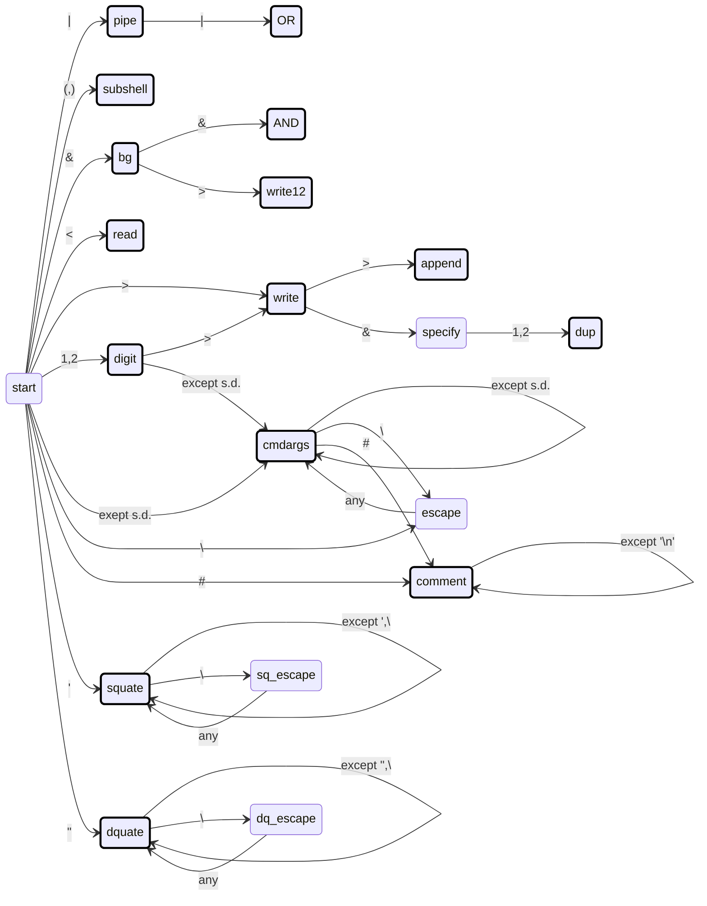
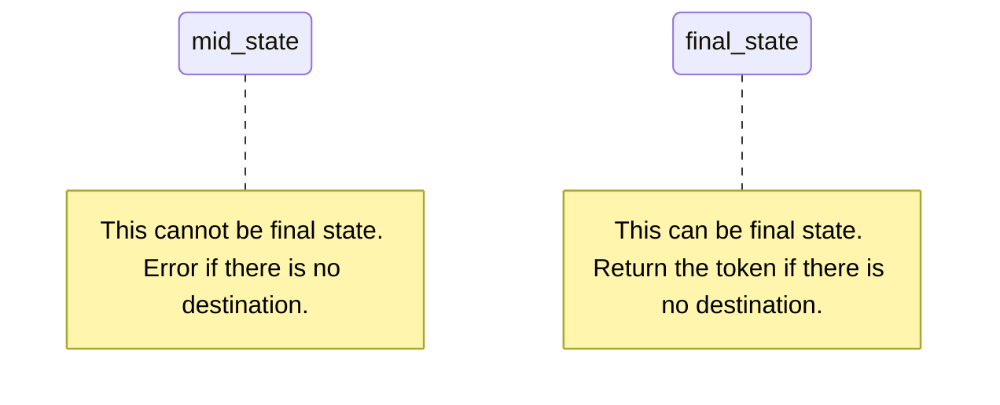

# home-made-shell

## Syntax

The available syntax are as follows:

```
command > file # stdout to file
command 1> file # stdout to file
command 2> file # stderr to file
command 1> fileA 2> fileB # stdout to fileA, stderr to fileB
command &> file # redirect stdout and stderr to file
cmd1 | cmd2 # connect stdout of cmd1 to stdin of cmd2.
```

The space can be ommitted:
```
command>file # stdout to file
command1>file # equal to "command1 > file". Different from "command 1> file"
```

## Lexical Tokenization

The Deterministic Finite Automaton(DFA) Diagram is as follows:



where




The s.d. (syntax delimiter) means following character set:

```
'>' '<' '&' '|' '\n' ' ' '(' ')' ''' '"'
```

This diagram is correspond to the class `LexicalTokenizer`.

## Recursive Descent Parsing

