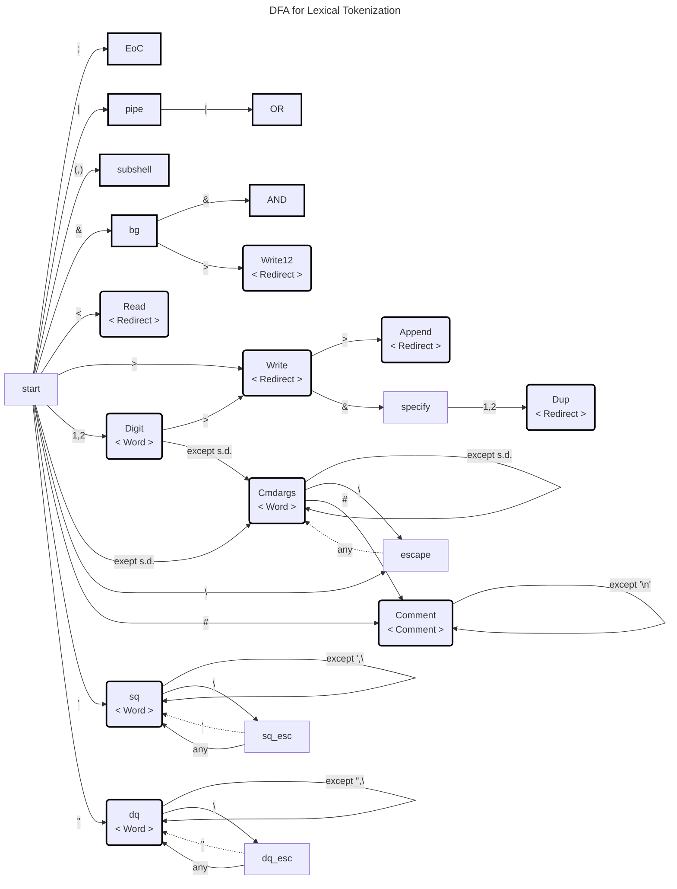
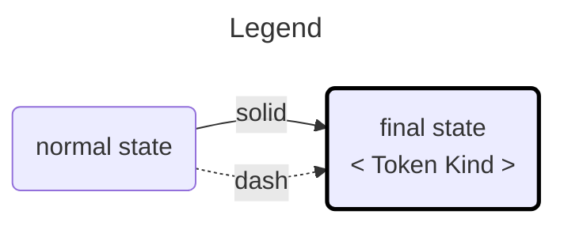

# home-made-shell

## Syntax

The available syntax are as follows:

```
command > file # stdout to file
command 1> file # stdout to file
command 2> file # stderr to file
command 1> fileA 2> fileB # stdout to fileA, stderr to fileB
command &> file # redirect stdout and stderr to file
cmd1 | cmd2 # connect stdout of cmd1 to stdin of cmd2.
```

The space can be ommitted:
```
command>file # stdout to file
command1>file # equal to "command1 > file". Different from "command 1> file"
```

## Lexical Tokenization

The class `LexicalTokenizer` is lexical tokenizer that represented by the following Deterministic Finite Automaton(DFA) Diagram.



where s.d. (syntax delimiter) means following character set.

```
'>' '<' '&' '|' ';' '\n' ' ' '(' ')' ''' '"'
```
The **bold border square** can be the **final state**. If you are at final state and there is no destination, the function retuns a token string.
The other square is the **normal state**, a token does not end at this state. Tokenization finished with error if there is no destination when you are normal state.

A solid line means transition to other state and append previous character to the token string. A dash line also means transition to other state, but it ignore previous character and it does not append a character to string array.

When there is not destination, the tokenizer retuns a token and `<Token Kind>` at the final state. The token kinds are correspond to the EBNF syntax symbols described in the next section.



## Recursive Descent Parsing

The home-made-shell syntax is defined by following Extend Backus Naur From(EBNF).

```EBNF
<Shell> ::= <Sentence> {(";"|"&") <Sentence> } [ <Comment> ]
<Sentence> ::= <ProcessGroup> [ ("&&" | "||" ) <ProcessGroup> ]
<ProcessGroup> ::= <Process> { | <Process> }
<Process> ::= <Command> | ( "(" <Shell> ")" )
<Command> ::= <Word> {<Word>} { <Redirect> }
<Word> ::= <cmdargs> | <squate> | <dq>
<Redirect> ::= ">"  |  ">>" |  ">&1" |  ">&2"
             | "1>" | "1>>" | "1>&1" | "1>&2"
             | "2>" | "2>>" | "2>&1" | "1>&2"
```

* `{}` is repeat 0 or more times.
* `[]` is optional.
* `a|b` means a OR b.

