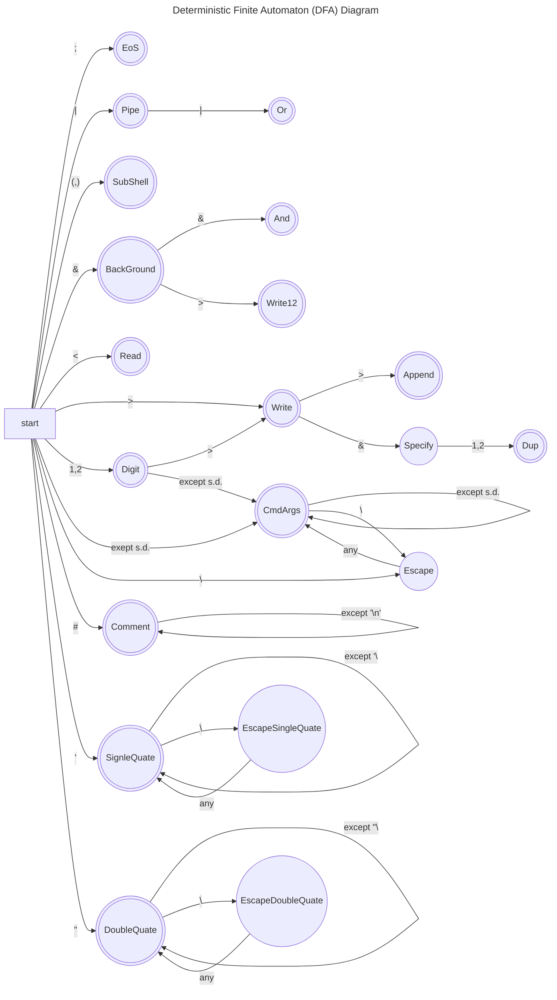
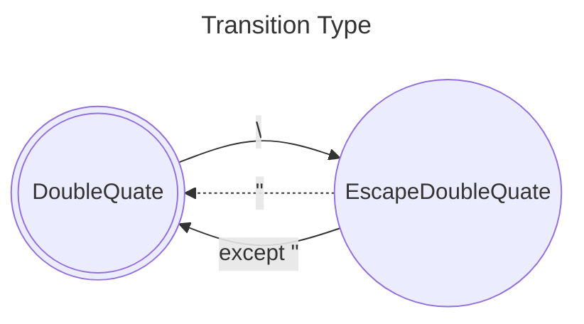
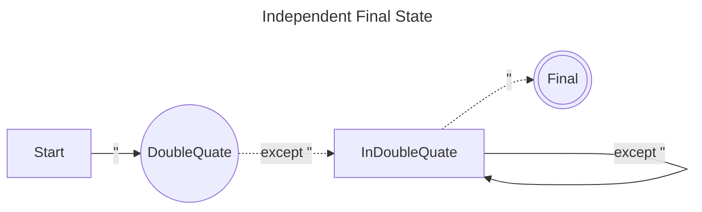
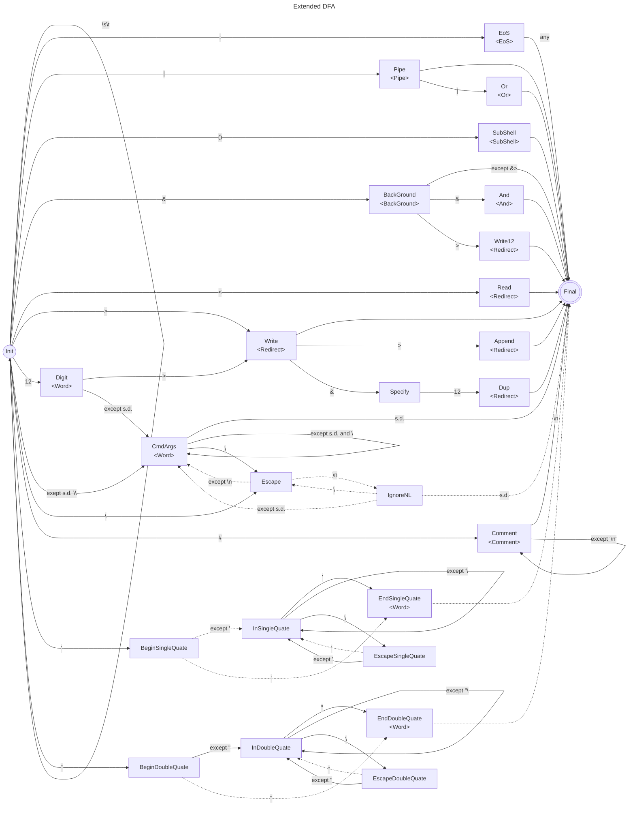

# home-made-shell

## Syntax

The available syntax are as follows:

```
command > file # stdout to file
command 1> file # stdout to file
command 2> file # stderr to file
command 1> fileA 2> fileB # stdout to fileA, stderr to fileB
command &> file # redirect stdout and stderr to file
cmd1 | cmd2 # connect stdout of cmd1 to stdin of cmd2.
```

The space can be ommitted:
```
command>file # stdout to file
command1>file # equal to "command1 > file". Different from "command 1> file"
```

## Lexical Tokenization

### Deterministic Finite Automaton

The lexical tokenizer is typically represented by the following Deterministic Finite Automaton(DFA) Diagram.



where **double circle** means final state, and s.d. (syntax delimiter) means following character set.

```
'>' '<' '&' '|' ';' '\n' ' ' '(' ')' ''' '"'
```

### Extend DFM

But above diagram has some problem when you coding Lexical Tokenizer.

#### Ignorable character

For example, input `"abc\efg"` means `abc\efg` itsself, but `"abc\"efg"` means `abc"efg`. In the Double-Quatation, the escape character `\` is removed when the next character is `"`, but `\` is not removed when the next is the other.
Then, we introduce two transition type; the **solid line** means "append previous character", the dash line means "ignore previous character".



#### Independent final state

In the diagram, there is two types of final state that are distinguished by the token contains the final character or not.
For example, if the automaton ended at DoubleQuate state, the token does not contain the character `"`. But if the automaton ended at `;`, the token contains `;`.
These difference is represented as transiton type to the independent final state.



#### Extended DFM for Lexical Tokenizer

Finally, we use the following Extended Deterministic Finite Automaton Diagram to describe the Lexical Tokenizer insdted of the typical DFM.
Each arrows are correspond to `TransitionTable` defined in `src/lexicaltokenizer.cpp`. The arrow has no condition means match any characters.



where the expression `<foo>` is the token type correspond to EBNF described in the next section.

## Recursive Descent Parsing

The home-made-shell syntax is defined by following Extend Backus Naur From(EBNF).

```EBNF
<Shell> ::= (<Sentence>)+ [ <Comment> ]
<Sentence> ::= <ProcessGroup> [ ("&&" | "||" ) <ProcessGroup> ] [";"|"&"]
<ProcessGroup> ::= <Process> { "|" <Process> }
<Process> ::= (<Command> | "(" <Shell> ")") { (<Redirect> <Word>) | <Dup> }
<Command> ::= (<Word>)+
<Word> ::= <CmdArgs> | <SignleQuate> | <DoubleQuate>
```

* `{a}` : Repeat `a` 0 or more times.
* `(a)+` : Repeat `a` 1 or more times.
* `[a]` : `a` is optional.
* `a|b` means a OR b.

